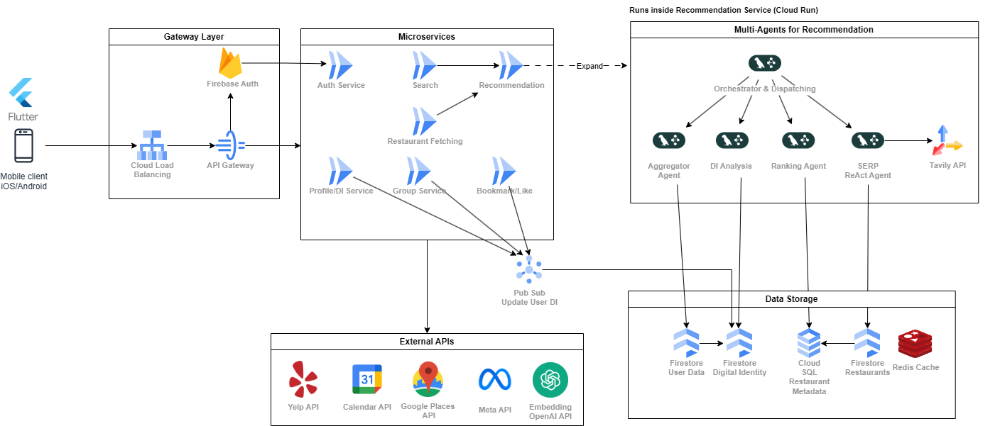

# System Architecture & Tech Stack Overview
# Tech Stack

- **Backend:** Python, deployed on **Google Cloud Run**.  
- **Frontend:** Flutter with Material Design 3, mobile-first with optional web support.  
- **Cloud Platform:** Google Cloud Platform (GCP).  

**Frameworks & Libraries**  
- LangChain – chaining LLM workflows.  
- LangGraph – current orchestration layer for recommendation agents.  
- Pydantic – schema validation and data modeling.  
- FastAPI – backend service framework.  

**APIs in Use**  
- Tavily API – real-time search augmentation.  
- OpenAI Embeddings API – embeddings for user digital identity and restaurant matching.  
- Meta API – optional integration of social context (Instagram, Facebook).  
- Yelp & Google Places API – restaurant metadata, menus, photos, ratings.  
- Google Calendar API (read-only) – event-driven dining suggestions.  

**Databases**  
- Firestore (NoSQL) – user data, digital identity, and restaurant documents.  
- Cloud SQL (Postgres) – Toronto restaurant dataset from Kaggle, structured metadata.  
- Redis Cache – used to reduce latency for hot queries.  

# Architecture Breakdown

## 1. Client & Gateway Layer

We chose **Flutter** because our focus is on delivering a mobile-first experience. Dining decisions are most often made on the go, so iOS and Android support was essential. At the same time, Flutter gives us flexibility to eventually expand to a web app without rewriting our frontend stack. Another consideration was team familiarity: Flutter was a stack we already knew, which sped up development for the MVP.  

The gateway layer includes **Cloud Load Balancing** and an **API Gateway**. We acknowledge that, for the MVP scope, these may not be strictly necessary. However, we included them in the architecture for future readiness. If usage scales or we expand beyond MVP, we will already have a design that can handle load distribution and API routing.  

Authentication is handled by **Firebase Auth**, chosen for its simplicity and tight integration with GCP. It provides login/logout management, token validation, and social login options without requiring us to implement a custom authentication layer.  

## 2. Microservices Layer

We opted for a **microservice architecture** over a monolith because most of our features are lightweight, independent, and well-defined. This makes it possible to scale specific services individually without complicating deployment. At the same time, Cloud Run allows us to keep overhead low and scaffold services quickly.  

The microservices include:  
- **Auth Service** – handles login, logout, token validation.  
- **Profile / Digital Identity (DI) Service** – stores and updates evolving user preferences, embeddings, and identity graphs.  
- **Search Service** – executes user-driven restaurant queries.  
- **Recommendation Service** – entry point into the recommendation pipeline and multi-agent system.  
- **Restaurant Fetching Service** – retrieves restaurant metadata and photos from Yelp and Google Places APIs.  
- **Group Service** – supports group dining decisions by merging multiple digital identities.  
- **Bookmark/Like Service** – allows users to save restaurants and refine personalization.  

**Pub/Sub Integration**  
Whenever a user takes an action (such as bookmarking, liking, or group voting), this event is published to **Pub/Sub**. Pub/Sub then updates the user’s Digital Identity asynchronously. This design ensures that the recommendation system always has fresh signals while keeping the main user request path fast and responsive.  

## 3. Multi-Agent Recommendation System

The **Recommendation Service** expands into a **LangGraph-powered multi-agent orchestration layer**. The agents specialize in different subtasks, coordinated by an orchestrator/dispatcher:  

- **Aggregator Agent:** Pulls candidate restaurants from the Restaurant Fetching Service.  
- **DI Analysis Agent:** Matches candidates against embeddings stored in Firestore Digital Identity.  
- **Ranking Agent:** Scores results based on embeddings (OpenAI), metadata (Cloud SQL), and hot trends (Redis).  
- **SERP ReAct Agent:** Enriches results with reviews, menus, and photos, and queries the **Tavily API** for additional real-time context.  

We experimented with CrewAI in early stages, but runtimes were too long. LangGraph was selected for its more efficient orchestration, and it remains flexible enough for future iteration.  

## 4. Data Storage & Reasoning

For the MVP, we use **Firestore (NoSQL)** to handle user data, digital identity embeddings, and restaurant documents. Firestore was chosen for its flexibility: our schemas will evolve quickly, and NoSQL allows us to store dynamic structures without rigid migrations. It also integrates natively with GCP, lowering operational overhead.  

- **Firestore User Data** – basic user information, tied to Firebase Auth.  
- **Firestore Digital Identity** – embeddings and evolving DI graph.  
- **Firestore Restaurants** – lightweight set of restaurant entries for quick retrieval.  

We also use **Cloud SQL** (Postgres) to hold structured data, specifically the Toronto restaurant dataset we imported from Kaggle. This relational store provides better support for structured queries, such as filtering by cuisine, location, or price range.  

**Redis Cache** is introduced for hot queries, trending restaurants, and recently fetched recommendations. It keeps response times low, which is essential for the TikTok-style feed UI.  

In the long term, we anticipate outgrowing Firestore for digital identity graphs. For production scale, we may migrate to **Google Graph Spanner** or **Bigtable**, which are better suited for graph data and large-scale analytics.  

## 5. External API Integration

- **Restaurant Fetching Service → Yelp & Google Places APIs.**  
- **Recommendation System (SERP Agent) → Tavily API.**  
- **Digital Identity Service → OpenAI Embeddings API.**  
- **Group/DI Analysis → Meta API (social context).**  
- **Calendar-Aware Suggestions → Google Calendar API.**  

This mapping ensures that each external dependency is scoped to a specific service, keeping the system modular and preventing bottlenecks.  

## Flow Summary

1. The user logs in through the Flutter app, which authenticates via **Firebase Auth** and passes requests through the **API Gateway**.  
2. The request reaches microservices such as Search, Group, or Bookmark/Like.  
3. Actions are published to **Pub/Sub**, which updates the user’s Digital Identity asynchronously.  
4. For recommendations, the request enters the **multi-agent system**, which fetches candidates, analyzes against DI embeddings, ranks them, and enriches the results.  
5. Results are cached in **Firestore and Redis** for quick retrieval.  
6. The final personalized list is returned to the user in a TikTok-style scrollable feed.  