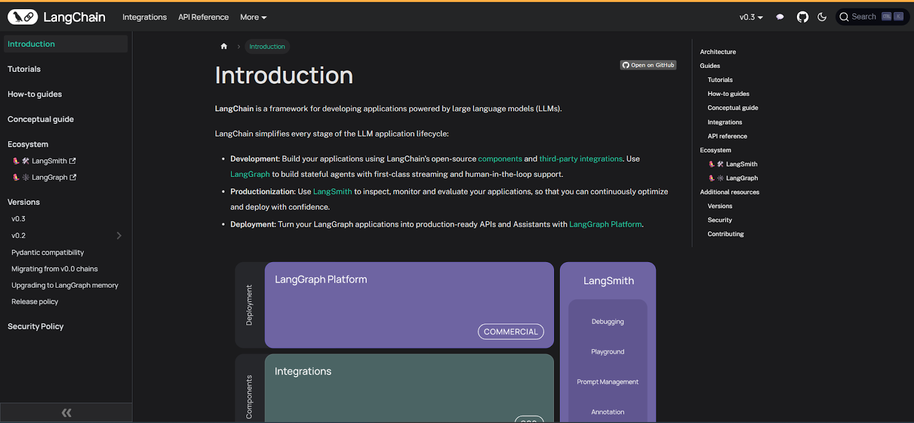
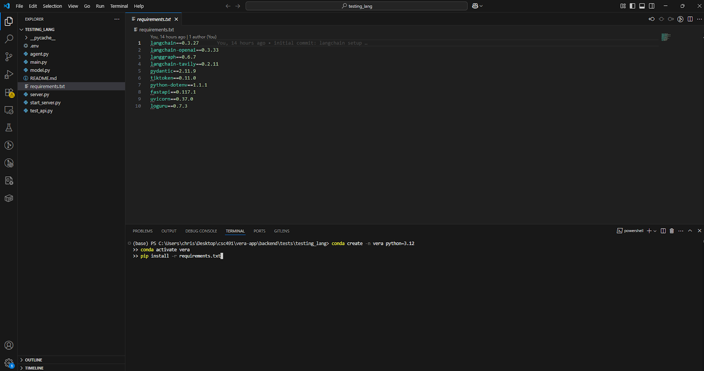
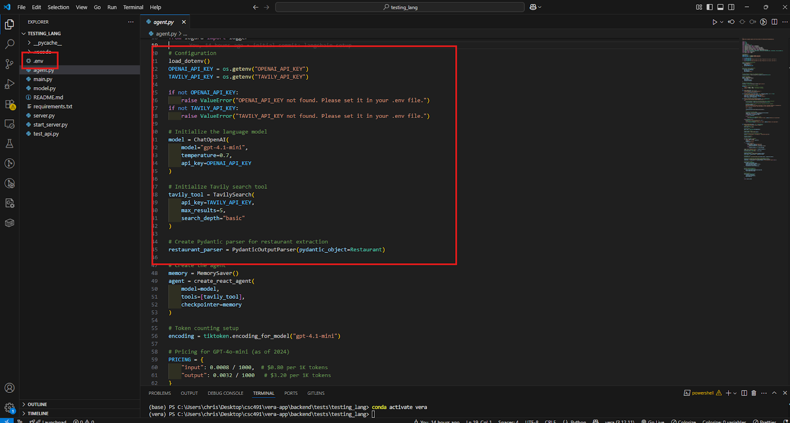
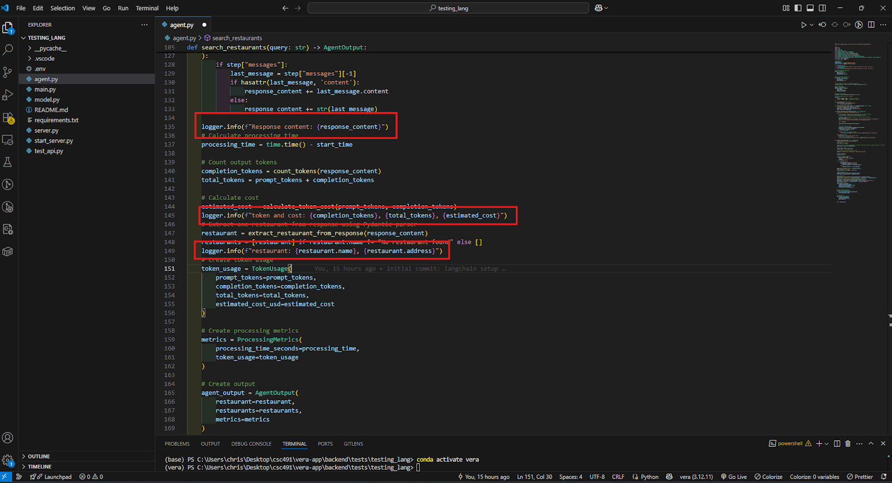
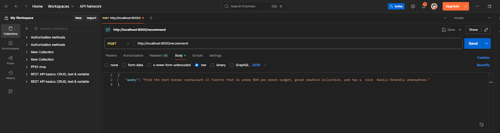

# A3 CUJ Runthrough + Demo of LangChain
In this document, we discuss our step-by-step experience using LangChain, an open-source Python and JavaScript framework for building LLM agents. We include recommendations for improvement, discussions regarding the most difficult steps, as well as tips for future users also unfamiliar with building agentic workflows.

### Submission Date: 24/09/2025

## Team Information
### Tentative Name – Vera   
Franco Miguel Valencia – 1009486771   
Jisung Shin – 1004192170

## TL;DR
LangChain is one of the most robust frameworks for building agentic workflows, offering flexible customization and supported by a large and growing community. Its documentation is **clear, accessible, and regularly updated**, making it approachable for new users. However, **debugging can be daunting**, as built-in observability is limited. To mitigate this, we recommend using `loguru` and `tiktoken` for transparency, while also keeping the LangChain documentation open alongside the IDE to streamline troubleshooting.
 

## Our User Goal
***“As an AI engineer, I want to build a ReAct agent so that I can automatically generate personalized restaurant recommendations.”***

## Summary of Findings

### User Persona
- 5th-year computer science specialist student
- Extensive experience building APIs for LLM applications
- Familiar with Pydantic and Tavily
- Limited experience with agent-based systems and no prior experience with LangChain

### Tools Used
- Google Search
- VS Code
- LangChain
- LangChain Documentation
- LangGraph
- Tavily (for SERP fetching and web scraping)
- OpenAI API GPT-4.1 model
- Pydantic (for type enforcing and schema validation)
- Postman (for API endpoint testing and validation)
- FastAPI (for building a lightweight web server and endpoints)
- Loguru (for debugging)
- Uvicorn (for running ASGI apps like FastAPI)
- Tiktoken (for token counting)
- Python-dotenv (for managing environment variables)
- Conda and virtualenv (for isolated Python environments)

### Reflection and Areas of Improvement

Overall, this CUJ experience helped us understand both the strengths and limitations of the LangChain/LangGraph ecosystem. Notably, the usability of the documentation was impressive: it was well-structured, easy to navigate, and updated to reflect recent library changes, making it easy for us to get started quickly. For example, we immediately noticed that the legacy `react_agent` function was outdated, and that using LangGraph was the recommended replacement. Furthermore, LangChain and LangGraph have a large and active community, with their Github repositories collectively surpassing 116k stars. Setting up the dependencies and environment variables was also straightforward, with minimal experience required.

However, the most severe pain point occurred during the implementation and testing of the ReAct agent. Observability was low; we had little insight into how long each step of the agent would take, how many tokens were being consumed at each step, and the overall internal state of the agent. LangChain does offer LangSmith for debugging and tracing, but learning such a platform might seem overly daunting for first-time users. Instead, we resorted to lightweight tools we were already familiar with, such as `loguru` for logging and `tiktoken` for tracking token usage. This highlights the need for more built-in observability functions in the LangChain library.

Lastly, deploying the FastAPI server was, thankfully, a smooth experience. Creating endpoints (`/`, `/health`/, and `/recommend`) was not overly complex, and verifying our server through Postman helped us confirm that the system was working as we intended.

Overall, we do have a couple of suggestions to make the process more friendly for first-time users or programmers new to agentic workflows:

### For LangChain (Product Improvements):
- Improve observability by offering clearer built-in logging/tracing using a simple boolean parameter without requiring LangSmith.
- Provide better documentation accessibility on how to integrate external tools (e.g., Tavily, Pydantic) into agent workflows.

### For Future Users:
- Be prepared to spend extra time on agent debugging, as observability is limited with just the built-in LangChain functions.
- Use lightweight logging tools such as loguru or tiktoken to track API behaviour and token use.
- If possible, keep documentation and Postman open in parallel with the IDE to minimize context-switching as much as possible.
- Understand the benefits of using ReAct agent as opposed to LLM calls, for example, reviewing resources such as: https://www.ibm.com/think/topics/react-agent

### Highlights and Lowlights

| Task | Severity / Difficulty | Notes |
| --- | --- | --- |
| Explore LangChain documentation (steps 1-3) | Great | Documentation was clear, easy to read, quick to navigate, and up-to-date with the latest best practices. |
| Initial setup and configuration (steps 4-8) | Moderate | Dependency installation was straightforward, but some time was needed to figure out how to integrate the built-in API modules (e.g., Tavily, OpenAI, Pydantic) |
| Implement and test ReAct agent (steps 9-12) | Severe | Low observability and challenges were encountered during debugging. Additional tools, such as loguru, were required to move forward with the process. |
| Deploy and test FastAPI server (steps 13-15) | Great | This process was straightforward once implemented—the `/recommend` endpoint worked cleanly with Postman verification. |

## CUJ Overview Table

| Task | Time to Complete Task | Number of Context Switches |
| --- | --- | --- | 
| Explore LangChain documentation (steps 1-3) | ~20 min | 1 |
| Initial setup and configuration (steps 4-8) | ~30 min | 2 |
| Implement and test ReAct agent (steps 9-12) | ~90 min | 5 |
| Deploy and test FastAPI server (steps 13-15) | ~60 min | 2 |

**Total Time**: ~200 mins (3 ⅓ hours)   
**Total Context** Switches: 10

## End-to-End User Journey Documentation
| Step | Notes | Screenshot |
| --- | --- | --- | 
| 1 | Looked up LangChain documentation to understand how agents are implemented |  |
| 2 | Looked up how to create a ReAct agent with the LangGraph library | 
| 3 | Noticed the built-in function for building a ReAct agent was outdated, so switched to reviewing LangGraph documentation instead for the updated function |  |
| 4 (switch) | Switched to VS Code and opened the project folder |  |
| 5 | Created a virtual environment using condafrom terminal to install all necessary dependencies |  |
| 6 (switch) | Switched to the OpenAPI and TavilyAPI platforms to obtain API keys and added them to a .env file |   |
| 7 | Set up API-related configurations with OpenAI, tiktoken, and Pydantic output schema for structured responses. |  |
| 8 |Started building a ReAct agent using the langgraph library |  |
| 9 | Set up a tool function to call Tavily |  |
| 10 | Set up a function to extract responses from the agent |  |
| 11 | Used loguru for debugging |  |
| 12 (switch) | Tested user queries via CLI and examined raw outputs, iterating until responses matched expectations |  |
| 13 | Built a FastAPI server with `/`, `/health`, and `/recommend` endpoints. |  |
| 14 | Used Postman to send POST requests to `/recommend` with sample queries |  |
| 15 | Verified that the server was correctly returning the desired agent response |  |

