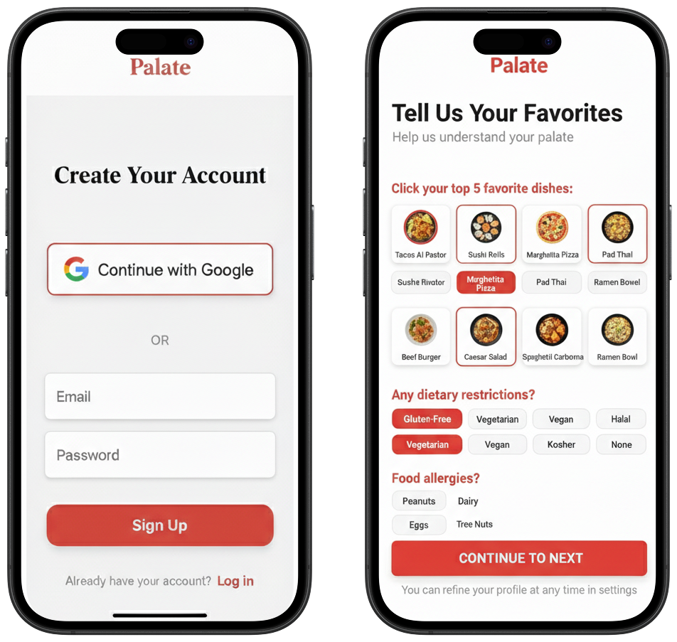
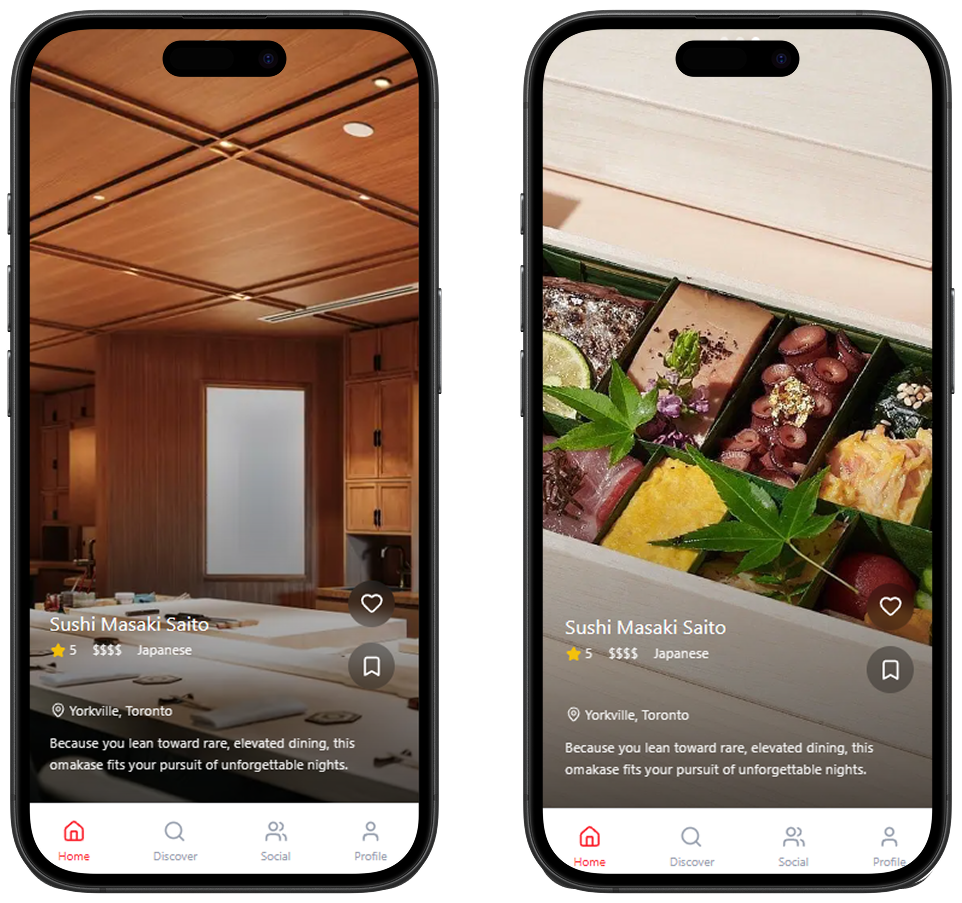
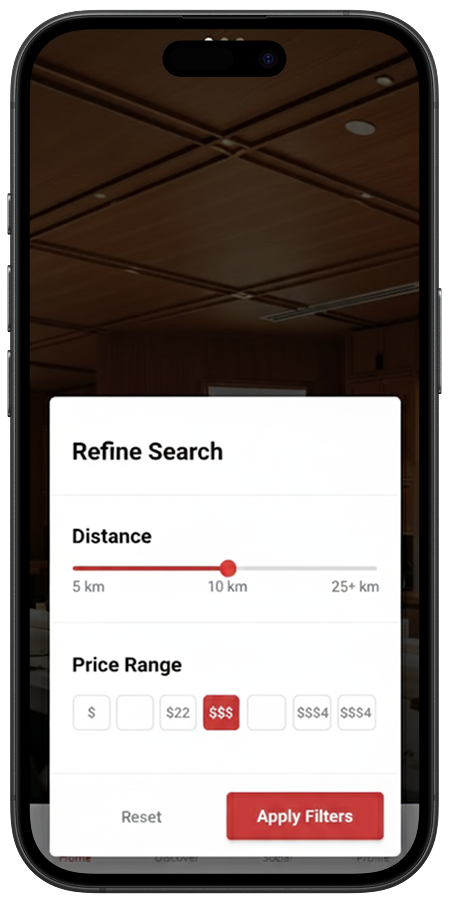
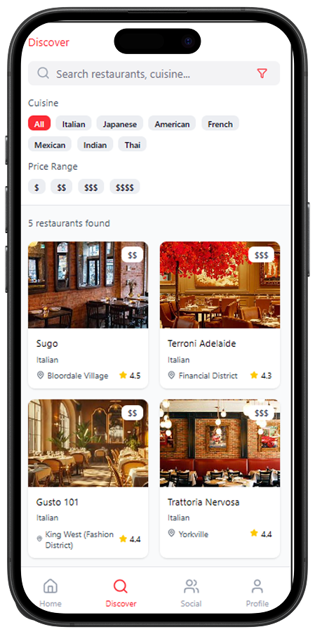
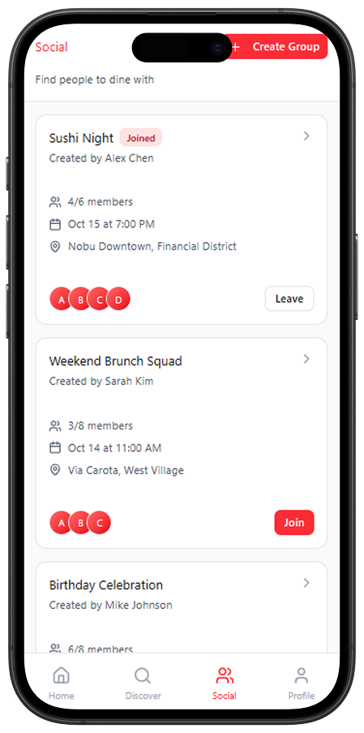
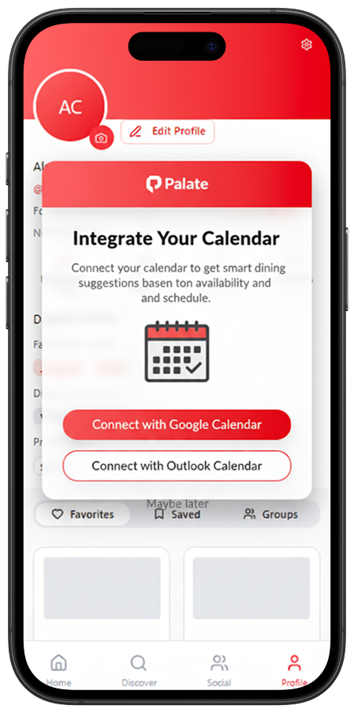

# Product Requirements

In this document, we discuss our main and secondary product requirements, jobs-to-be-done (JBTDs), customer user journeys (CUJs), and focuses. Please see our [architecture folder](../architecture) for a more detailed description of our tech stack and our [roadmap](roadmap.md) for an in-depth tentative timeline for our project.

## Jobs-to-be-Done Product Requirements

We have **three main focuses** that we describe here in our jobs-to-be-done (JTBD):

*As a Gen Z newcomer to university, I want to find a cheap sit-down restaurant near campus that offers great gluten-free options so that I stay within my budget and not worry about dietary restrictions.*   
→ **Focus**: We want our application to take into account budget, distance, and dietary options.

*As a professional business consultant, I want to find a quiet coffee shop with a calm atmosphere and tables spaced far apart, so that I can hold private business discussions with a potential client.*   
→ **Focus**: We want our application to go even deeper, understanding restaurant vibes and user-specific hyperpersonalized preferences.

*As a group of friends reuniting after 4 years, we want to find a place that balances everyone’s dining preferences so that everyone can focus on reconnecting rather than stressing about food choices (and no one feels awkward telling the others they turned vegan).*   
→ **Focus**: We want our application to automatically balance groups of preferences, accommodating everyone’s preferences and schedules.

 

# Main CUJs

Based on these three JTBDs, we have **three primary CUJs** and **three secondary CUJs** that we aim to implement by the end of this course.

## M1. Create an Account and Build a Hyper-Personalized Profile

### In Summary
*A new user signs up, answers a short onboarding quiz (or connects a provider), and lands on a home feed with an initialized "taste profile."*

### Scope and Assumptions
Email + password (or Google OAuth) should be supported. Optionally, add a Google Maps "Saved places" import from a user's Google account.

### Primary Flow
1. User taps Sign up → chooses Google or Email.
2. If Email: enters email, password → Create Account.
3. Onboarding quiz (≤ 90 seconds):
   - Dietary flags (gluten-free, vegetarian, halal, etc.)
   - Budget range ($–$$$$)
   - Distance comfort (walkable, transit-friendly, any)
   - Vibe (casual, date-night, study-friendly, bar-lounge…)
   - Top cuisines (multi-select)
4. (Optional) Connect Google to import Saved places (start with a mock list in MVP).
5. System builds an initial Taste Vector (weights per cuisine, vibe, price, diet).
6. User sees success toast: "Profile set. You can refine your profile at any time."
7. App routes to Home → Recommendations.

### Data, Rules, and Edge Cases:
- Store: diet flags, cuisine weights, price tolerance, distance prefs, vibe weights, (optional) imported favorites.
- Event log: signup_completed, onboarding_completed, integration_attempted/success/denied.
- Privacy: show inline note: "You control data sources; disconnect anytime."
- If the user does NOT give location permission, default to postal code. Distance filters should still work.

### Our Goals
- 95% of users can complete signup + quiz in ≤ 2 minutes.
- Taste profile object persists; can be retrieved on refresh.
- If the quiz is skipped, a default profile is created; recommendations still render.
- Optional: Phone verification, multi-factor auth, advanced data portability.

## M2. Get a Personalized Restaurant List with Images and Rationale

### In Summary
The user opens the app and sees a ranked list of restaurants with images, a short personalized blurb that explains "why this fits you," and quick badges (diet, price, vibe).

### Scope and Assumptions
Static image URLs via public APIs or seed set; light-weight ranking; basic rationale text.

### Primary Flow
1. User lands on "Home" → the "For You" page is immediately visible.
2. System fetches a candidate set of restaurants within a default radius (e.g., 3 km).
3. Restaurants by a "Taste Fit Score" (profile weights × restaurant features) + proximity + baseline rating; all weighed by a LangChain agent.
4. Render list cards:
   - Cover image
   - Name, cuisine, price tier
   - Personalized rationale (1–2 lines, e.g., "Matches your gluten-free + casual vibe; under $$, 10-min walk").
   - Badges (diet supported, "quiet-study," "date-night," etc.)
5. Tap a card → Details: gallery, hours, location, highlight reviews (2), dietary notes. Include 2-3 reviews that corroborate the description, with words or phrases highlighted that align with the user’s profile and can be used to explain why this restaurant was recommended (e.g., "Why We Think You’ll Like It: …")
6. Optional: Option to save a restaurant to a list.

### Data, Rules, and Edge Cases
- Inputs: profile vector, geolocation, restaurant catalog (features, images, ratings).
- Event log: `feed_impression`, `card_view`, `detail_open`, `rationale_seen`.
- Text generation: template-driven to help with consistency.
- No candidates within radius → prompt to expand distance or loosen filters.
- If there are missing images → use a fallback placeholder.
- Low data density → broaden the search by cuisine, distance, or price automatically (with notice).

### Our Goals
- Feed loads in ≤ 2s (mock data OK for now).
- The top 10 items have a rationale for being shown.
- The detail screen shows at least 3 images (or placeholders) and 2 corroborating reviews.
- Optional: Real-time availability, table booking, UGC reviews.

## M3. Adjust Distance and Filter Categories to Refine Results

### In Summary
The user narrows results using distance, price, diet, cuisine, and vibe filters and immediately sees the list update.

### Scope and Assumptions
Client-side re-ranking is acceptable in MVP; for now, fast feedback is key.

### Primary Flow
1. From the "For You" page, the user opens Filters (sheet or panel)
2. Adjusts Distance slider (e.g., 0.5–10 km).
3. Toggles Dietary (gluten-free, halal…), selects Price ($–$$$), Cuisine chips, Vibe chips.
4. Taps Apply → list re-ranks and rerenders with chip summary ("≤2 km, $$, GF, Casual").
5. Optional: Reset to defaults.

### Data, Rules, and Edge Cases
- Filters overwrite or weight the profile vector (e.g., hard constraints for diet).
- Event log: `filters_open`, `filters_apply`, `filter_zero_results`.
- Save the last used filter set per user.
- If no results show up → try showing a smart suggestion: "Try increasing distance to 3–5 km or include $$."
- Conflicting filters (e.g., vegan + steakhouse) → show empty state with actionable fix.

### Our Goals
- Apply → results update in ≤ 500 ms on test data.
- Zero-state message appears when appropriate with a one-tap fix.
- Saved filters persist across sessions.
- Optional: Multi-sort (e.g., "Newest"), map clustering.

 

# Secondary CUJs

CUJs we aim to implement if we have the time.

## S1. Create a Group and Get Group-Wide Recommendations

### In Summary
The user creates a group, invites friends, and sees a group-balanced recommendation list.

### Scope and Assumptions
User send a simple invite by link; the group taste is created as a weighted blend of member profiles; quorum-based logic can be implemented optionally.

### Primary Flow
1. User taps "Create Group" → names it (e.g., "Friday Dinner").
2. Invites via "Copy link" (mock join OK for MVP).
3. Members join; system computes "Group Taste Vector" (average with diet as hard constraint).
4. Group Recommendations list appears with rationale (e.g., "Balances vegan + halal + $$ within 2 km").
5. Optional: quick poll (👍/👎) to refine top picks.

### Data, Rules, and Edge Cases
- Aggregation: diet = intersection; price = min(max tolerances); cuisine/vibe = mean of weights.
- Event log: `group_created`, `group_joined`, `group_recs_viewed`, `vote_cast`.
- Only one member → fall back to personal recs with "Invite more for better balance."
- If there are conflicting hard diets → try showing "split suggestions" (two shortlists) with explanation.
- If a member leaves → recompute group taste vector.

### Our Goals
- Group recommendations should render ≤ 5s after 2+ members join.
- Diet conflicts surfaced with a clear message and two viable alternatives.
- Votes update ordering in real time or on refresh.
- Optional: calendar auto-scheduling that takes into account everyone’s availabilities.

## S2. Link Calendar to Suggest Time/Place Windows 

### In Summary
The user links their calendar so the app can "nudge" ideal dining windows and nearby options.

### Scope and Assumptions
Read-only calendar, though a .ics file may be optionally generated to add a restaurant booking to a calendar; simple "free block" detection; nearby recs for next free slot. Mock data is acceptable for the MVP.

### Primary Flow
1. User opens Settings → Calendar → Connect (Google Calendar).
2. App reads the next 7 days in the calendar and finds ≥30-min free blocks around lunch/dinner times.
3. On the "Today" tab, show "Next free block: 12:30–1:30 PM" + See nearby CTA.
4. Tapping CTA filters to venues within radius and suited vibe ("quiet-study" for coffee, "casual" for lunch).
5. One-tap Save candidate to a "Shortlist".

### Data, Rules, and Edge Cases
- Event log: `calendar_connect_attempt/success`, `timeblock_detected`, `calendar_based_recs_opened`.
- Privacy note should be clearly visible with an easy Disconnect.
 
 ### Our Goals:
- At least one free block should be listed after connecting a calendar (use a mock calendar for MVP).
- "See nearby" correctly filters to time-appropriate venues.
- Optional: Attendee coordination (with groups, as mentioned previously), auto-invites with .ics, travel-time optimization.

## S3. Search for a specific restaurant (name or keyword)

### In Summary
The user searches a restaurant by name ("Touhenboku Ramen") or keyword ("noodles") and opens a detail page.

### Scope and Assumptions
Simple search box with prefix match + a few keyword synonyms; result list with the same card layout as feed.

### Primary Flow
1. User taps Search, types query.
2. Autocomplete suggestions (names/cuisines) appear.
3. Press Enter → results page.
4. Tap a result → Details (images, rationale, badges).

### Data, Rules, & Edge Cases
- Index: name, cuisine, tags (diet, vibe), neighborhood.
- Event log: `search_query`, `search_no_results`, `result_open`, `shortlist_add`.
- No results → show guidance ("Try ‘ramen’, broaden distance").
- If the restaurant name is ambiguous → show top 5 with neighborhood tags.

### Success criteria:
- Top-1 precision acceptable for exact names.
- Keyword queries return ≥ 5 relevant results from the seed dataset.
- Optional: semantic vector search, typo-tolerant fuzzy matching

 

# Functional and Non-Functional Requirements
Using the CUJs and JTBDs we have defined above, we have created a list of functional and non-functional requirements we hope to achieve by the end of this course.

## Functional Requirements

### Account & Identity
**F1.1**: The system must allow users to sign up and log in via email/password or Google OAuth.   

**F1.2**: The system must support creation of a personalized taste profile through onboarding questions (dietary restrictions, cuisine, price, distance, vibe).   

**F1.3**: The system must allow users to update and refine their taste profile at any time.

### Recommendations
**F2.1**: The system must generate a personalized ranked list of restaurants that matches the individual’s digital identity (taste profile).

**F2.2**: Each recommendation must display:   
- Restaurant image(s)
- Cuisine type, price tier, vibe, dietary compatibility
- A personalized rationale ("why this fits you") and restaurant description with 2-3 customer reviews as sources   

**F2.3**: The system must allow users to filter results (distance, cuisine, vibe, dietary needs, price).

### Group Functionality (Secondary)
**F3.1**: Users must be able to create a group and invite others.

**F3.2**: The system must generate group recommendations that balance member preferences.

**F3.3**: The system must allow group members to vote or react to refine choices.

### Search & Integrations (Secondary)
**F4.1**: Users must be able to search by restaurant name or keyword (e.g., "Touhenboku Ramen").

**F4.2**: Users must be able to link their calendar (Google Calendar integration) to suggest nearby restaurants during free time blocks.

## Non-Functional Requirements

### Performance
**NF1.1**: Personalized recommendation list must load within 5 seconds for a set of ≤100 candidate restaurants.

**NF1.2**: Filters must re-rank results and render the updated list within 3 seconds.

### Usability
**NF2.1**: Onboarding flow must be complete within 2 minutes.

**NF2.2**: Recommendations should include clear rationale text that is understandable to a non-technical user.

**NF2.3**: Empty or conflicting filter states must present a helpful message with next steps (e.g., expand distance).

### Security & Privacy
**NF3.1**: User login and auth credentials must be stored securely (hashed + salted).

**NF3.2**: Users must have control over data sharing (calendar integration, profile info) with clear opt-in/out.

**NF3.3**: No third-party data integration (e.g., Google Calendar, Maps) should expose private user data beyond the necessary scope.

 

# Architecture Design and Roadmap

Please see our [architecture folder](../architecture/) for a description of our tech stack and our [roadmap file](roadmap.md) for an in-depth tentative timeline of our project.
