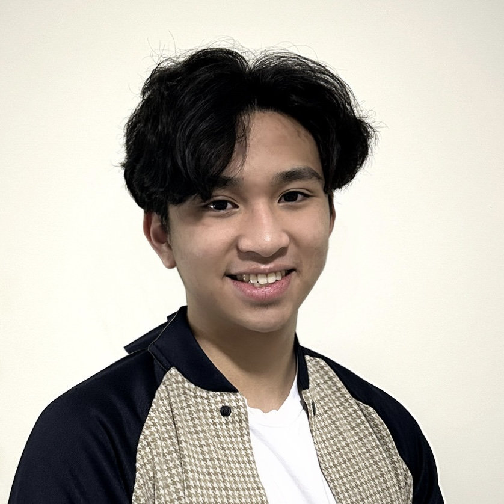

# Franco Miguel Valencia

**Computer Science, Neuroscience, Psychology**   
Data Science | Software Development   
📧 francomiguel.valencia@gmail.com
  
## Links
- [GitHub](https://github.com/Funkey08)
- [LinkedIn](https://www.linkedin.com/in/franco-miguel-valencia-6a650b219/)
- [Resume](https://drive.google.com/file/d/1yKRrd3qEXcOEOkTc8ijD-XIIMQltLRxJ/view?usp=sharing)
- [Website](https://funkey08.github.io/hi-im-franco/)

## About Franco
Franco is a fourth-year at the University of Toronto studying Computer Science, Neuroscience, and Psychology. With a multidisciplinary research background integrating computer systems and analytics across various academic fields, he has worked with faculty from faculty ranging from Stanford and Yale to the Swiss Federal Institute of Technology and the National University of Singapore. In his free time, he enjoys learning new instruments or languages, reading sci-fi, or watching an anime.

## Strengths
- Highly adaptable and multidisciplinary mindset
- Ability to complement, organize, and structure teams with diverse members
- Values open communication and meaningful criticism

## Weaknesses
- Can get frustrated when little tangible progress is made over a period of time
- Productivity is sometimes affected by mood
- Limited knowledge of current trends in technology

## Languages & Tools
- Languages: Python, R, SQL, Java, JavaScript/TypeScript, HTML/CSS, MATLAB
- Libraries & Frameworks: React/Next.js, scikit-learn, pandas, NumPy, PyTorch, SciPy, tidyverse, seaborn, Electron, Vite
- Tools: Git/GitHub, AWS, Jupyter, Google Colab, Excel/Google Sheets, Jira (Agile)
  
## Closing Note
*I once got kicked out of an all-you-can-eat buffet for eating too much.*
